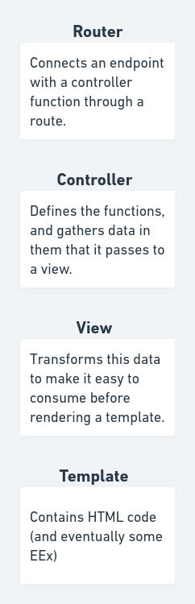

# 04-17-2022

## Goals
<!-- What we expect to get from the day -->
- Introduction to Phoenix framework.
- `mixins`

## Resources
<!-- How are we going to achieve it -->
- [Ludu's Phoenix course](https://www.ludu.co/course/discover-elixir-phoenix/elixir-phoenix)

## Outcomes
<!-- What we actually got -->
- Introduction to Phoenix project structure.

## Notes
<!-- Relevant notes to the day's progress -->

## Next steps
<!-- What we will be working on tomorrow -->
- Templates in Phoenix.
- Elixir's `mixins`.

## Resources worth checking out
<!-- Other resources we could benefit from -->
